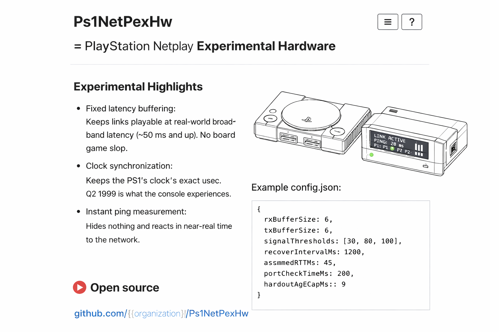

# Ps1NetPexHw
PlayStation 1 NetPlay Experimental Hardware

## What This Is
A hardware experiment that enables real PlayStation 1 consoles to attempt online play by synchronizing controller input in time, not by emulation or video streaming.

## What This Is Not
- Not an emulator
- Not rollback netcode
- Not zero-latency
- Not guaranteed to work for all games

## Core Idea
Time belongs to the endpoint. Latency is stabilized, not eliminated. Failure is visible.

## Hardware Concept
A small device that sits between PS1 controllers and the console, timestamps input, exchanges tiny packets over a network, and injects input aligned to the console’s frame timing.

## Why This Exists
Because PS1 netplay has been wanted since 1994, and no one seriously explored real-hardware, time-aligned input mediation.

## Status
Early concept.
Looking for contributors in firmware, hardware, and testing.

